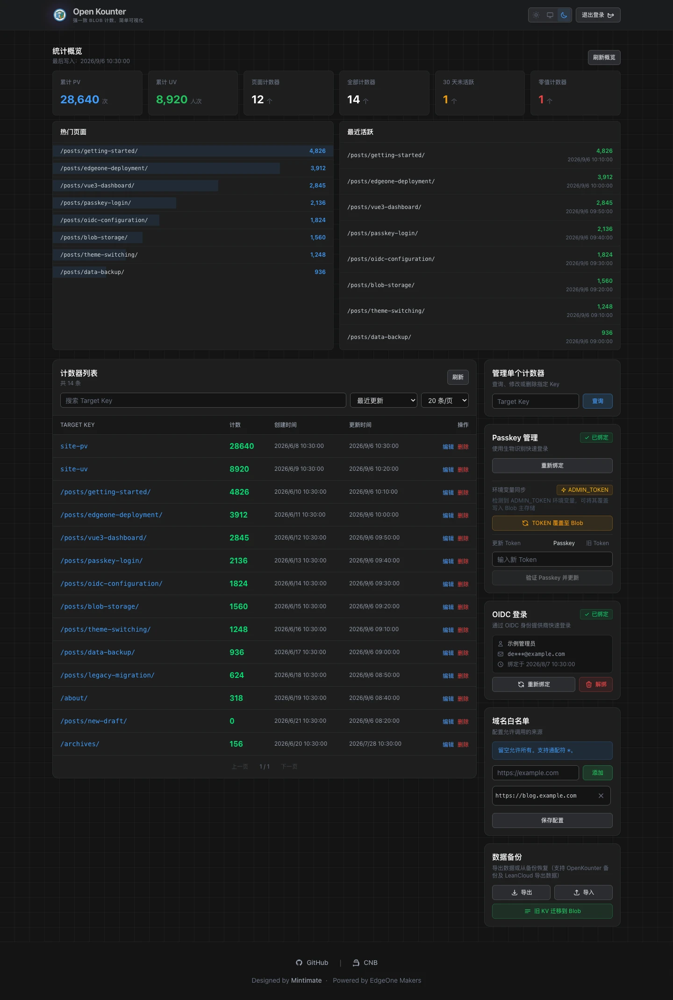
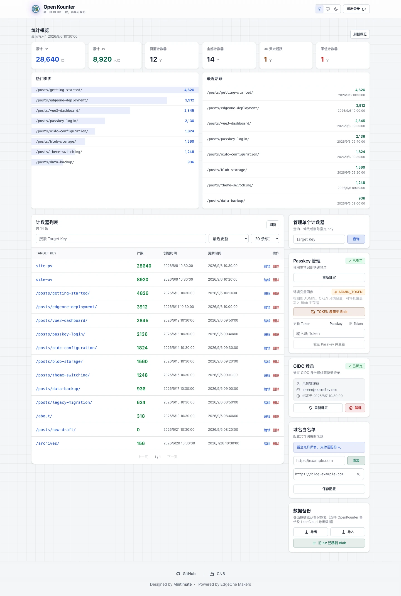
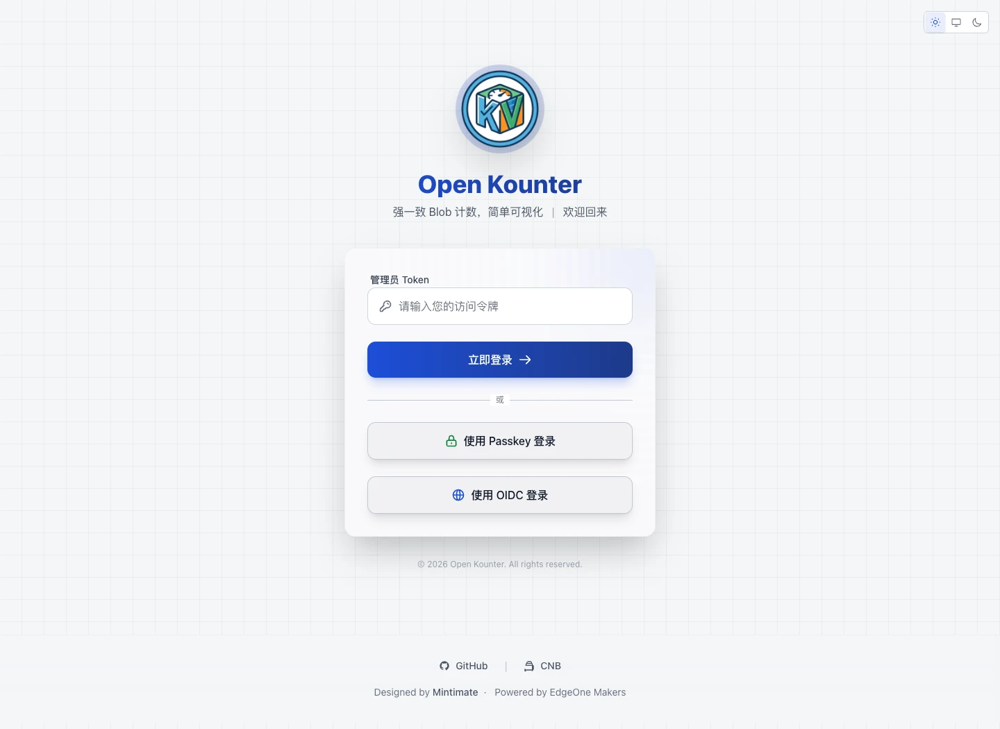

# Open Kounter

Open Kounter 是一个基于 EdgeOne Pages Functions 和 Blob 存储的无服务器计数器服务，旨在替代 LeanCloud 为静态网站（如 Hexo）提供 PV/UV 统计功能。它包含一个完整的管理后台，支持数据管理、导入导出、域名白名单、旧版 KV 一键迁移、Passkey 无密码登录、OIDC 单点登录，以及亮色 / 跟随系统 / 暗色主题切换。

## 功能概览

| 功能 | 说明 |
|---|---|
| 访问计数 | 单个 / 批量递增，支持站点及页面自定义 Target Key |
| 统计概览 | 累计 PV / UV、计数器数量、零值与未活跃统计、热门页面和最近活跃 |
| 计数管理 | 搜索、排序、分页、修改计数与删除条目 |
| 登录认证 | Token、Passkey 和 OIDC；登录页按配置与绑定状态显示入口 |
| 数据维护 | JSON 导入导出、域名白名单、旧版 KV 迁移 |
| 界面主题 | 亮色、跟随系统、暗色，适配桌面和移动端 |

统计概览读取 `site-pv` 与 `site-uv` 作为站点累计指标。后端提供计数操作，UV 去重由接入端负责；仓库中的适配器按浏览器本地记录进行 24 小时去重，不代表跨设备的独立用户识别。

适配器将本次需要递增的目标合并为一次 `batch_inc`，使用服务端返回的计数更新显示。同时显示三项统计时，新访客仅需一次递增请求，24 小时内回访另需一次 UV 读取（均不含跨域预检）。统计关闭、DNT 生效或忽略本地访问时只读取，不写 UV 标记；只有服务端确认 UV 递增成功后才保存标记。请求超时为 15 秒，覆盖响应体读取。请求失败不会提前显示 `+1`，递增也不会自动重试；网络中断时服务端可能已经写入，当前接口不提供幂等重试保证。

## 界面预览

以下图片由当前版本的实际界面截取，统计值、页面路径和账号信息均为示例数据。

**暗色仪表盘**：统计概览、热门页面、计数器列表，以及右侧管理面板。



<details>
<summary>查看亮色仪表盘</summary>



</details>

<details>
<summary>查看登录页：Token、Passkey 与 OIDC</summary>



</details>

快速跳转：[部署](#edgeone-pages-上部署) · [AI 迁移 Skill](#安装-ai-skill) · [API 文档](#api-接口文档) · [环境变量](#环境变量一览) · [登录方式](#登录方式) · [升级注意事项](#升级注意事项) · [本地验证](#本地验证与并发边界)

项目背景：[LeanCloud 遗憾谢幕：基于 EdgeOne Blob 打造高性能 PV/UV 访客统计](https://www.mintimate.cn/2026/02/14/openKounter/)。部署配置与接口行为以本 README 和当前代码为准。

## 安装 AI Skill

本仓库提供 `migrate-to-open-kounter` Skill，可帮助 AI 检查网站中的 LeanCloud 计数逻辑，并自动适配到用户已经部署的 Open Kounter。

> 使用前必须先部署 Open Kounter，并向 AI 提供可访问的 HTTPS 服务域名。未部署或未提供域名时，Skill 会拒绝修改项目。
>
> 请在需要迁移的目标项目根目录执行安装命令。该 Skill 建议按项目安装，不建议使用 `-g` 全局安装。

### 中国大陆：推荐使用 CNB

```bash
npx skills add https://cnb.cool/Mintimate/tool-forge/open-kounter.git --skill migrate-to-open-kounter -y
```

### 非中国大陆：推荐使用 GitHub

```bash
npx skills add https://github.com/Mintimate/open-kounter.git --skill migrate-to-open-kounter -y
```

如需只安装到指定 Agent，可增加 `--agent` 参数，例如安装到 Codex：

```bash
npx skills add https://cnb.cool/Mintimate/tool-forge/open-kounter.git --skill migrate-to-open-kounter --agent codex -y
```

安装后可通过 `$migrate-to-open-kounter` 调用，例如：

```text
使用 $migrate-to-open-kounter，把当前项目的 LeanCloud 计数替换为 Open Kounter。
Open Kounter 服务地址：https://counter.example.com
```

## EdgeOne Pages 上部署

你可以通过 EdgeOne Pages 一键部署或手动配置构建：

一键部署：

[](https://console.cloud.tencent.com/edgeone/pages/new?repository-url=https://github.com/Mintimate/open-kounter)

> **注意**：点击上方按钮前，建议先 Fork 本仓库，并在跳转后的页面中确认仓库地址为你 Fork 后的地址。

手动部署配置：

- 框架预设：Vite（与 `edgeone.json` 中的 `framework: "vite"` 一致）
- Makers 构建命令：`npm run build:makers`（前端构建后生成私有路由及定时配置）
- 输出目录：`dist`
- Node 版本：`22`

平台文档：[Cloud Functions](https://pages.edgeone.ai/document/cloud-functions) · [Blob 存储](https://pages.edgeone.ai/document/blob-storage)。仓库保留 EdgeOne Pages 的目录及 SDK 命名，平台界面也可能显示为 EdgeOne Makers。

`npm run build` 继续用于本地前端构建。Makers 部署须使用 `edgeone.json` 中的 `npm run build:makers`，输出字段为官方 `outputDirectory`。它生成 `.edgeone/routes.json`，供平台保留现有函数路由、静态资源优先匹配及 SPA fallback，并注册原生定时任务；该文件不在 `dist/` 内。

manifest 生成器适配本仓库的静态 JavaScript 函数入口和 SPA。若新增动态函数路由、其它函数运行时、框架默认导出、Middleware、Agents 或额外的 `headers` / `redirects` / `rewrites`，须同步扩展生成器；当前遇到这些不支持的配置会明确中止构建，避免静默丢失路由配置。

### 为什么从 KV 切换到 Blob

Open Kounter 早期使用 EdgeOne Pages KV 保存计数器、配置和认证信息，但 KV 的全球同步是最终一致模型，在多节点场景下会有明显同步延迟。

- 计数器刚写入后，后台列表或下一次读取可能短时间内看不到最新值。
- 域名白名单、Token、Passkey 相关状态在边缘节点之间同步时，也可能出现短暂不一致。
- 对于计数器这类“写完就要立刻读到最新结果”的场景，KV 的全球同步延迟会直接影响可用性。

现在主存储使用 Blob，核心读取路径启用强一致模式，绕过边缘缓存读取最新写入。强一致读取不等于原子递增；并发写入仍需互斥，当前锁的恢复边界见 [Blob 并发与恢复设计](docs/blob-concurrency.md)。

### 配置 Blob 存储（必需）

本项目使用 Blob 作为主存储，部署后会在 cloud-functions 中自动创建并使用名为 `open-kounter` 的 Blob Store。

1. **开启 Blob 能力**
    - 在 EdgeOne Pages 控制台进入项目设置 > 存储
    - 确认项目已开通 Blob 能力

2. **首次访问自动创建 Store**
    - 默认会使用 `open-kounter` 作为 Blob Store 名称
    - 如需自定义名称，可设置环境变量 `OPEN_KOUNTER_BLOB_STORE`

3. **Passkey 域名配置（可选）**
    - Passkey 默认使用服务端 `request.url` 的 Origin 和 hostname，不信任请求的 `Origin` / `Referer` 头；如平台内部转发地址与公开域名不同，请设置 `PASSKEY_ORIGIN=https://你的公开域名`
    - 如需固定 RP ID 或跨环境统一配置，可设置环境变量 `PASSKEY_RP_ID`
    - 如需自定义显示名称，可设置环境变量 `PASSKEY_RP_NAME`

4. **OIDC 单点登录配置（可选）**
    - 如需启用 OIDC 登录，请先在 EdgeOne Pages 环境变量中配置 OIDC 参数，并在 OIDC Provider 中把 Redirect URI 设置为 `https://你的域名/api/oidc/callback`
    - 配置完成后，管理员先使用 Token 登录后台，在 OIDC 登录模块中绑定身份；绑定成功后，登录页会自动显示 OIDC 登录按钮
    - 具体变量说明和使用流程见下方“环境变量一览”和“登录方式”章节

5. **重新部署项目**
    - 启用 Blob 或调整环境变量后建议重新部署

### 旧版 KV 迁移（可选）

如果你是从旧版 KV 存储迁移，请额外绑定旧 KV 命名空间，变量名仍为：`OPEN_KOUNTER`。

- 新部署且没有历史数据时，不需要绑定 KV。
- 已有旧 KV 数据时，可在登录页或后台“数据备份”面板中点击“旧 KV 迁移到 Blob”。

### 初始化

部署完成后访问项目网址：未预设 `ADMIN_TOKEN` 时，按页面提示创建管理员 Token；已预设时，使用该 Token 登录。Token 登录成功后，可在后台绑定 Passkey 或 OIDC。


## 目录结构与文件说明

```tree
.
├── client/
│   └── adapter.js          # 客户端适配器，模拟 LeanCloud 行为
├── cloud-functions/        # 主后端逻辑 (Blob API)
│   └── api/
│       ├── _api.js         # 响应、CORS 与鉴权工具
│       ├── _blobStore.js   # Store 工厂、Key、导入校验与锁
│       ├── _counterValidation.js # 计数参数与来源白名单校验
│       ├── _challengeCleanup.js # 过期 Challenge 分批扫描与断点
│       ├── _scheduledCleanupAuth.js # 构建/运行时共用的定时清理专用鉴权
│       ├── _legacyMigration.js # 旧 KV 导入
│       ├── _oidc.js        # Discovery、JWKS、PKCE 和 Cookie
│       ├── _passkey.js     # WebAuthn 验签与旧凭证兼容
│       ├── auth.js         # 认证逻辑
│       ├── counter.js      # 计数器读写、列表与统计聚合
│       ├── init.js         # 初始化与迁移接口
│       ├── passkey.js      # Passkey 相关逻辑
│       ├── maintenance/
│       │   └── challenges.js # 管理员手动及原生定时清理
│       └── oidc/           # OIDC 单点登录
│           ├── login.js    # OIDC 登录发起
│           ├── callback.js # OIDC 回调处理
│           └── status.js   # OIDC 绑定状态查询
├── edge-functions/         # 兼容旧版 KV 的迁移出口
│   └── legacy-api/
│       └── migrate.js      # 导出旧 KV 数据供 Blob 导入
├── src/                    # 前端管理后台 (Vue 3 + Vite)
│   ├── components/
│   │   ├── common/
│   │   │   ├── ConfirmModal.vue         # 通用确认弹窗
│   │   │   └── ThemeSwitcher.vue        # 三段式主题切换
│   │   ├── dashboard/
│   │   │   ├── AnalyticsOverview.vue    # 累计指标、热门页面与最近活跃
│   │   │   ├── CounterList.vue          # 计数器列表
│   │   │   ├── DataBackup.vue           # 数据备份与恢复
│   │   │   ├── DomainConfig.vue         # 域名白名单配置
│   │   │   ├── OidcManager.vue          # OIDC 绑定管理
│   │   │   ├── PasskeyManager.vue       # Passkey 管理
│   │   │   └── SingleCounterManager.vue # 单个计数器管理
│   │   ├── Dashboard.vue   # 仪表盘主组件
│   │   ├── Login.vue       # 登录组件
│   │   └── NotFound.vue    # 404 页面
│   ├── App.vue             # 主应用组件
│   ├── main.js             # 入口文件
│   ├── style.css           # 全局样式与主题 Token
│   ├── utils/latestRequest.js # 请求取消、超时和响应序号保护
│   ├── utils/requestJson.js # 登录请求超时、取消与响应校验
│   ├── utils/passkeyCeremony.js # 每次 Passkey 流程的取消与清理
│   └── theme.js            # 主题解析与持久化
├── tests/                  # 认证、导入、锁与请求乱序回归测试
├── docs/blob-concurrency.md # Blob 并发设计与遗留锁恢复
├── scripts/build-makers-manifest.mjs # 生成私有路由及定时任务配置
├── other/                  # README 的当前版本界面截图
├── edgeone.json            # EdgeOne 配置文件
├── index.html              # HTML 入口
├── package.json            # 项目依赖
├── tailwind.config.js      # Tailwind 配置
└── vite.config.js          # Vite 配置
```

## API 接口文档

主 API 的基础路径为 `/api`，旧 KV 迁移出口为 `/legacy-api/migrate`。JSON 响应使用 `code: 0` 表示成功、`1000` 表示失败、`1404` 表示未找到；通常 HTTP 状态为 200，调用端还须检查业务 `code`。`OPTIONS` 返回 204，OIDC 浏览器跳转使用 302。

**计数参数约束**：读取、递增、设置、删除及导入使用同一 Target Key 规则：必须是非空、非纯空白的字符串，长度不超过 2048；有效 Key 原样保留。计数值必须为非负安全整数（`0`～`Number.MAX_SAFE_INTEGER`），也接受仅含数字的字符串；负数、小数、混合文本和超出安全整数范围的值均被拒绝。递增溢出会报错，不写入计数文档。

### 公开接口 (无需认证)

#### 1. 获取计数

- **URL**: `GET /api/counter`
- **参数**: `target` (必填，计数器的 Key，如 `site-pv`)
- **响应**:
  ```json
  {
    "code": 0,
    "data": {
      "time": 100,
      "target": "site-pv",
      "created_at": 1700000000000,
      "updated_at": 1700000000000
    }
  }
  ```

#### 2. 增加计数 (自增)

- **URL**: `POST /api/counter`
- **Body**:
  ```json
  {
    "action": "inc",
    "target": "site-pv"
  }
  ```
- **说明**: 受域名白名单限制。

#### 3. 批量增加计数

- **URL**: `POST /api/counter`
- **Body**:
  ```json
  {
    "action": "batch_inc",
    "requests": [
      { "target": "site-pv" },
      { "target": "/posts/hello-world/" }
    ]
  }
  ```
- **说明**: 常用于同时更新站点总 PV 和单页 PV。受域名白名单限制。
- **限制**: `requests` 最多 100 项，每项必须提供合法 `target`，或兼容的 `/classes/Counter/<target>` 形式 `path`。空数组返回 `[]`，不获取写锁。所有项目先校验再写入；任一项目非法或递增溢出，整批失败，不保存部分计数。
- **响应**: `data` 为按请求顺序返回的 `{ target, time }` 数组，`time` 是该次递增后的计数。同一 target 重复出现时依次递增，调用端可以直接使用响应更新显示。

### 管理接口 (需要认证)

需要在 Header 中携带 `Authorization: Bearer <YOUR_TOKEN>`。

#### 1. 设置计数器值

- **URL**: `POST /api/counter`
- **Body**:
  ```json
  {
    "action": "set",
    "target": "site-pv",
    "value": 1000
  }
  ```
- **限制**: `value` 遵循上述非负安全整数规则，与导入保持一致，不使用截断解析。

#### 2. 删除计数器

- **URL**: `POST /api/counter`
- **Body**:
  ```json
  {
    "action": "delete",
    "target": "site-pv"
  }
  ```

#### 3. 获取计数器列表

- **URL**: `POST /api/counter`
- **Body**:
  ```json
  {
    "action": "list",
    "page": 1,
    "pageSize": 20,
    "query": "/posts/",
    "sortBy": "count",
    "sortOrder": "desc"
  }
  ```
- **可选参数**:
    - `query`: 按 Target Key 进行不区分大小写的包含匹配。
    - `sortBy`: `target` / `count` / `created_at` / `updated_at`，默认 `updated_at`。
    - `sortOrder`: `asc` / `desc`，默认 `desc`。
    - `includeSummary`: 布尔值，默认 `false`；为 `true` 时额外返回 `data.summary`，结构与 `summary` 接口一致，始终统计全部计数器。仪表盘列表与概览共用这次读取。
- **响应说明**: `total` 为筛选后的数量，`allTotal` 为全部计数器数量。

#### 4. 获取统计概览

- **URL**: `POST /api/counter`
- **Body**: `{ "action": "summary" }`
- **响应**:
  ```json
  {
    "code": 0,
    "data": {
      "sitePv": 12000,
      "siteUv": 3500,
      "totalCounters": 42,
      "pageCounters": 40,
      "staleCounters": 3,
      "zeroCounters": 1,
      "staleAfterDays": 30,
      "latestUpdatedAt": 1700000000000,
      "generatedAt": 1700000000000,
      "topPages": [],
      "recentlyActive": []
    }
  }
  ```
- **说明**: 直接聚合现有累计计数器，不新增 Blob Schema；热门页面与最近活跃均排除 `site-pv` 和 `site-uv`，各返回最多 8 条。

#### 5. 导出所有数据

- **URL**: `POST /api/counter`
- **Body**: `{ "action": "export_all" }`
- **响应**: 包含所有计数器数据和配置的 JSON 对象。

#### 6. 导入数据

- **URL**: `POST /api/counter`
- **Body**:
  ```json
  {
    "action": "import_all",
    "data": {
      "counters": {
        "site-pv": 12000,
        "/posts/hello-world/": {
          "time": 256,
          "created_at": 1700000000000,
          "updated_at": 1700086400000
        }
      },
      "allowedDomains": ["https://blog.example.com"]
    }
  }
  ```

**导入校验**：`data.counters` 必须为对象（允许 `{}` 清空）；Key 与计数值遵循上述共同规则，记录形式使用 `time`，可选时间戳 `created_at` / `updated_at` 为非负安全整数。可选 `allowedDomains` 与白名单配置接口使用相同校验及规范化。先完整校验，再在锁内覆盖，写入失败不会因为预先删除而丢失旧计数。计数与域名配置属于两个文档，不提供跨文档事务。

#### 7. 配置域名白名单

- **URL**: `POST /api/counter`
- **Body**:
  ```json
  {
    "action": "set_config",
    "allowedDomains": ["https://blog.example.com", "*.example.com"]
  }
  ```

白名单接受 HTTP(S) Origin（例如 `https://blog.example.com`）、子域通配项（例如 `*.example.com`）和 `*`。保存及导入时去掉首尾空白、规范化域名大小写与默认端口并去重；不接受带用户名/密码、非根路径、查询参数或 fragment 的配置。

`*.example.com` 只匹配 `blog.example.com`、`a.blog.example.com` 等子域，不匹配 `example.com`、`evil-example.com` 或 `example.com.evil.test`；精确 Origin 同时匹配协议和端口。空数组或 `*` 允许所有来源，无 `Origin` 的请求保持兼容放行。白名单用于限制浏览器计数来源，不能替代防刷措施或管理接口的 Bearer 鉴权。

读取历史白名单时，无效条目不参与匹配、不阻断其余合法条目，也不会被自动删除；保存配置或通过 `import_all` 导入时仍需修正全部无效条目。

### OIDC 接口

OIDC 相关接口用于单点登录绑定、登录回调和状态管理。

#### 1. 发起 OIDC 授权

- **登录**：`GET /api/oidc/login?mode=login`，要求当前 Issuer 已绑定，成功后返回 302。
- **绑定**：`POST /api/oidc/login`，携带 `Authorization: Bearer <YOUR_TOKEN>`，Body 为 `{ "mode": "bind" }`。返回 `{ "code": 0, "data": { "authorizationUrl": "..." } }`，前端再跳转。
- **安全约定**：不再接受 URL 中的管理员 Token。后端保存 5 分钟的 `state` / `nonce` / PKCE verifier 和浏览器随机值的摘要，通过 HttpOnly、Secure、SameSite=Lax Cookie 将回调绑定到发起登录的浏览器。Provider 须支持 HTTPS、OIDC Discovery/JWKS、PKCE S256，以及 `client_secret_basic` 或 `client_secret_post`。
- 同一浏览器同时发起多个 OIDC 流程时，仅最新流程的 Cookie 有效；旧流程需重新发起。

#### 2. OIDC 回调

- **URL**: `GET /api/oidc/callback?code=xxx&state=yyy`
- 验证浏览器 Cookie 和配置，唯一消费 state，再携带 PKCE verifier 换码。
- 使用 `jose` 和 Provider JWKS 验证签名及 `iss` / `aud` / `exp` / `iat` / `nonce`；多 audience 时校验 `azp`。仅接受配置的非对称签名算法集合，不回退到未验证的 userinfo。
- `bind` 模式重新确认管理员授权仍有效，并保存身份；`login` 模式匹配 `issuer + sub`。
- 登录成功返回有效期 60 秒的一次性 Session；Session 只保存身份及 Token 摘要，不保存实际管理员 Token。

#### 3. 查询 / 解绑 OIDC 状态

- **URL**: `POST /api/oidc/status`
- **Body**:
  ```json
  { "action": "get_status" }
  ```
- **说明**: 查询 OIDC 是否已配置、是否已绑定；解绑需携带 `Authorization: Bearer <YOUR_TOKEN>` 并传入 `{ "action": "unbind" }`。

#### 4. 使用 OIDC Session 换取管理 Token

- **URL**: `POST /api/auth`
- **Body**:
  ```json
  {
    "action": "oidc_verify",
    "oidcSession": "<session-id>"
  }
  ```
- **说明**: 前端在 OIDC 回调后自动调用；Session 通过条件创建消费回执保证只能成功交换一次，同时核对当前绑定身份、绑定时间和 Token 摘要。解绑、重新绑定或 Token 变更后，旧 Session 失效。

### Passkey 校验与兼容

- Cloud Functions 使用 `@simplewebauthn/server` 校验注册响应及登录签名，包括 challenge、可信 Origin、RP ID、用户存在/验证标志与签名计数器；注册和登录均要求 `userVerification: required`。
- `POST /api/passkey` 的 `generateAuthenticationOptions` 支持 `data.purpose`，默认 `authentication`；调用 `generateManagementToken` 前须传 `management`，两类 challenge 不能互换。管理 Token 必须由新版本验签生成，并且仅能消费一次。
- 新凭证使用 Base64URL 编码的 COSE 公钥并标记 `publicKeyFormat: "cose"`。旧版存储的 attestationObject 会在验证 RP ID 和 Credential ID 后提取公钥，成功验签后才更新格式；无法解析的旧凭证需通过 Token 登录后重新绑定。
- 升级前进行中的登录/绑定需重新发起；旧版未验证的临时管理凭证不再接受。实际管理员 Token 仅在成功的登录交换中返回，以兼容现有前端 Bearer 鉴权。

### Passkey Challenge 生命周期与清理

- 注册、登录和管理验证各自生成独立、5 分钟有效的 Challenge，以随机 ID 条件创建，不复用或续期。新流程不删除其它流程的 Challenge，也不再设置用户级 `currentChallengeId`；历史字段不参与新流程判定，仅在消费/取消同 ID 时清理匹配的旧引用。
- 验证仍校验用途、Origin、RP ID、签名和签名计数器，并唯一消费对应 Challenge。并行流程互不删除 Challenge；同一凭证的签名计数器读改写在用户锁内执行，乱序到达的较小计数器仍可能被拒绝。重新注册仍替换该用户旧凭证，并发注册按提交顺序串行保存。
- 前端在取消、失败、卸载或 `pagehide` 时，尽力调用 `POST /api/passkey`，Body 为 `{ "action": "cancelChallenge", "data": { "challengeId": "<本次 ID>" } }`。取消仅针对该 ID，可重复调用；ID 为 1～128 位字母、数字、下划线或连字符。取消未过期 Challenge 时仍保留一次性消费回执；已过期原文档可以直接清理。调用端必须持有本次生成响应中的 ID，不能按用户名取消其它流程。
- 前端清理请求使用独立的 5 秒超时，离开页面使用 `keepalive`；不会阻塞下一次重试。生成选项最多等待 15 秒，以便清理取消后迟到的 ID。无法收到 ID、断网或浏览器终止时，仍可能遗留原文档。验证成功不重复取消，验签请求不自动重试。

#### 回收过期 Challenge

- **URL**：`POST /api/maintenance/challenges`
- **手动鉴权**：`Authorization: Bearer <管理员 Token>`，复用管理 API 鉴权；Body 可传 `{}`。
- **定时鉴权**：无 `Authorization` 时，接受私有定时配置生成的 `{ "cleanupToken": "<清理专用凭证>" }`，请求体最多 1024 字节。配置密钥缺失、凭证错误或请求体无效均拒绝；带有 `Authorization` 的请求只按管理员鉴权，不回退到定时凭证。
- 请求体限制按原始流字节计算，兼容 Makers 将 `request.body` 包装为已解析 JSON 的运行时行为。
- 调用方不能指定清理前缀、Key 或过期时间。专用凭证仅被此端点接受，不能用于其它管理 API。
- **响应示例**：`{ "code": 0, "data": { "scanned": 100, "deleted": 80, "skipped": 20, "failed": 0, "hasMore": true } }`。

| 字段 | 含义 |
|---|---|
| `scanned` | 本次尝试读取的 Challenge 文档数量 |
| `deleted` | 本次完成删除的过期原文档数量 |
| `skipped` | 未过期、缺失、过期字段无效或不在允许前缀内的条目数量 |
| `failed` | 本次读取、JSON 解析或删除失败的数量；`code: 0` 不代表该值一定为 0 |
| `hasMore` | 是否仍有扫描进度需要继续；为 `true` 时可再次调用同一接口 |

每批最多检查 100 条，仅删除 `passkey/challenges/` 下 `expiresAt` 为有限数字且已过期至少 60 秒的原文档。使用强一致列举与读取，约 10 秒后停止开始新的操作；已开始的存储操作会等待完成，因此这不是强制的 HTTP 超时。进度保存到 `system/maintenance/passkey-challenges.json`，扫描结束后归零，下次调用重新全扫。临时读取或删除失败会保留重试位置；坏 JSON 保留并跳过，下一轮全扫再次检查。

回收与旧 KV 迁移共用不可抢占锁，锁忙时本次失败，稍后重试。回收不删除 `auth/consumed/` 回执、Passkey 凭证、用户数据或其它锁；相关恢复边界见 [Blob 并发与恢复设计](docs/blob-concurrency.md)。

#### Makers 原生定时调用

公开的 `edgeone.json` 声明任务 `passkey-challenge-cleanup`：北京时间每天 **03:00**（`Asia/Shanghai`）POST 到 `/api/maintenance/challenges`，每次运行上述一批回收。`hasMore: true` 时由下一次运行续扫，也可以管理员手动继续；每日一批不保证当天清空任意规模的积压。

启用步骤：

1. 在 Makers 项目的目标部署环境中配置 `OPEN_KOUNTER_CLEANUP_SECRET`，使用密码管理器生成至少 32 字符的随机密钥；同一环境的构建与函数运行时必须能读到相同值，建议只为生产环境配置。
2. 使用 `npm run build:makers` 构建并部署。脚本从密钥派生固定清理用途的 HMAC 凭证，仅将凭证写入权限为 `0600`、已被 Git 忽略的 `.edgeone/routes.json` 的 `schedules[].payload`，不写入根 `edgeone.json`、前端资源或日志。
3. 在 Makers 控制台检查任务和执行日志。已通过专用凭证鉴权的执行会输出 `passkey_challenge_cleanup` 统计日志，不输出请求体、密钥或凭证；关注 `failed` 和 `hasMore`，失败后可手动重试或等待后续运行。

原生定时任务使用静态 JSON payload，因此专用凭证是仅允许清理的可重放权限凭证，不是平台调度身份签名。轮换密钥必须重新构建并部署以同步 payload。密钥缺失时，构建产物不注册此任务，保留手动清理并输出停用说明；配置了不足 32 字符的非空密钥则构建失败，避免误用弱密钥。每次 Makers 构建都会重新生成私有 manifest，避免沿用旧凭证。

不要将 `.edgeone/routes.json` 作为静态文件上传或共享。直接上传预构建 `.edgeone` 时，应确保它刚由 `build:makers` 与 Makers 构建流程生成，密钥与目标运行环境一致。原生调度与构建输出约定见 [定时配置](https://pages.edgeone.ai/zh/document/edgeone-json#schedules) 与 [构建输出规范](https://pages.edgeone.ai/zh/document/building-output-configuration)。

## 环境变量一览

| 变量名 | 必需 | 说明 |
|--------|------|------|
| `OPEN_KOUNTER_BLOB_STORE` | 否 | 自定义 Blob Store 名称，默认 `open-kounter` |
| `OPEN_KOUNTER_CLEANUP_SECRET` | 启用定时清理时需要 | 至少 32 字符的随机密钥；构建与函数运行时保持一致。缺失时不注册定时任务，手动清理仍可用；轮换后需重新构建部署，禁止使用 `VITE_` 前缀或公开该值 |
| `OPEN_KOUNTER` | 否 | 旧 KV 命名空间绑定，仅在旧数据迁移期间需要；不是普通字符串变量 |
| `ADMIN_TOKEN` | 否 | 预设管理员 Token（优先级高于 Blob 中存储的 Token） |
| `PASSKEY_RP_ID` | 否 | Passkey RP ID，默认使用当前域名 |
| `PASSKEY_ORIGIN` | 否 | 可信的公开 Origin，例如 `https://counter.example.com`；默认从服务端请求 URL 推导，内部转发域名不一致时必须配置 |
| `PASSKEY_RP_NAME` | 否 | Passkey 显示名称，默认 `Open Kounter` |
| `OIDC_ISSUER` | 否 | OIDC Issuer URL，例如 `https://auth.example.com/realms/master` |
| `OIDC_CLIENT_ID` | 否 | OIDC 客户端 ID |
| `OIDC_CLIENT_SECRET` | 否 | OIDC 客户端密钥，仅保存在环境变量中 |
| `OIDC_REDIRECT_URI` | 否 | OIDC 回调地址，例如 `https://your-domain.com/api/oidc/callback` |

## 界面主题

管理后台支持亮色、跟随系统和暗色三种模式，默认跟随操作系统。主题入口在登录页右上角和登录后的顶栏中：

1. **亮色**：固定使用亮色 Token。
2. **跟随系统**：监听操作系统主题变化并实时切换。
3. **暗色**：固定使用暗色 Token。

用户选择保存在浏览器的 `open_kounter_theme` 中；该值仅用于界面偏好，不包含认证信息。

亮色和暗色模式共享统一的控件语义：仪表盘短操作按钮采用紧凑尺寸，并与相邻输入框保持等高；输入框独立保留移动端可读字号，避免聚焦时页面缩放。主色、成功和警示按钮使用随主题 Token 变化且满足可读对比度的低饱和色块。亮色模式下输入框统一为白底描边，暗色模式保持更深的输入区域；页面背景使用主题自适应的低对比度网格，丰富层次但不干扰内容阅读。

## 登录方式

Open Kounter 支持三种登录方式，登录页会自动检测可用的登录方式并渐进式展示：

1. **Token 登录**（始终可用）：使用管理员 Token 直接登录，也用于首次初始化和找回访问权限。
2. **Passkey 登录**（按需展示）：在后台绑定 Passkey 后，登录页自动显示 Passkey 登录按钮。
3. **OIDC 登录**（按需展示）：配置 OIDC 环境变量并在后台绑定 OIDC 账号后，登录页自动显示 OIDC 登录按钮。

OIDC 的使用顺序建议如下：

1. 在 EdgeOne Pages 环境变量中配置 `OIDC_ISSUER`、`OIDC_CLIENT_ID`、`OIDC_CLIENT_SECRET`、`OIDC_REDIRECT_URI`。
2. 在 OIDC Provider 中配置回调地址：`https://你的域名/api/oidc/callback`。
3. 使用管理员 Token 登录 Open Kounter 后台。
4. 在后台的 OIDC 登录模块中点击“绑定 OIDC 身份”。
5. 绑定成功后退出登录，登录页会出现“使用 OIDC 登录”按钮。

OIDC 绑定身份会保存在 Blob 的 `system/state.json` 中；登录过程中的临时 `state` 和一次性 Session 会写入 `oidc/states/*.json` 与 `oidc/sessions/*.json`，并通过 `expiresAt` 做应用层过期控制。

> 登录页并发检测初始化、旧 KV 与 Passkey 状态，加载占位至少显示 600ms，检测请求最多等待 5 秒；登录网络请求超时为 15 秒，并支持卸载取消。可选能力检测失败时隐藏对应入口，Token 登录仍可使用；未绑定旧 KV 属于正常未开启。初始化状态未知或检测失败时提供重试，并按 Token 登录处理；仅明确检测到未初始化时才允许初始化。

已保存 Token 的校验遇到网络故障、服务器错误或无效响应时，保留本地 Token、保持未认证状态并提供重试；只有明确的认证失效响应才清除 Token。OIDC 一次性 Session 兑换不自动重试。

## 升级注意事项

从旧版本更新前，建议通过后台导出计数器与域名配置。当前修复保留 `system/counters.json` 的 `2.1` 布局，计数数据无需迁移到新格式。

- **Passkey**：旧凭证在成功验签后转换公钥格式；不可验证时使用 Token 登录后重新绑定。平台内部请求域名与公开域名不同时，设置 `PASSKEY_ORIGIN`。
- **OIDC**：Provider 需支持 PKCE S256。绑定改为带 Bearer 鉴权的 POST，旧的 `?mode=bind&token=...` 调用方式不再接受；后台界面已适配。
- **进行中的登录**：旧版 challenge、OIDC Session 和未经过新版验签的管理 Token 会被拒绝，重新发起登录或绑定即可。
- **Challenge 回收**：新流程不再互相替换 Challenge。配置 `OPEN_KOUNTER_CLEANUP_SECRET` 并使用新的 Makers 构建命令可启用每日原生回收，手动接口继续可用。混用旧版本部署时，旧版本仍可能删除旧 `currentChallengeId` 指向的流程，应一并升级。消费回执继续保留，不属于本次自动删除范围。
- **导入数据**：导入是覆盖操作；完整校验后再写入，不预先删除计数文档。多个 Blob 文档之间没有事务。
- **参数校验**：设置计数与导入统一使用非负安全整数，批量递增最多 100 项；不再接受截断后有效的混合文本。历史数据中的非法计数或白名单需修正后再导入，升级不会自动清理或迁移已有数据。
- **遗留锁**：函数异常终止可能留下锁，当前版本不会自动抢占。恢复前必须暂停写入并确认所有在途操作已结束，按 [恢复步骤](docs/blob-concurrency.md#遗留锁恢复) 处理。

## 本地验证与并发边界

```bash
npm ci
npm test
npm run build
```

回归测试使用内存 Blob、本地生成的签名密钥和浏览器请求模拟，覆盖 Passkey、OIDC 完整绑定/登录、重复消费、计数及白名单校验、导入失败、锁竞争、适配器请求合并与 UV 标记、登录故障处理及请求乱序，不连接线上存储。服务端认证库在 Node.js 20 上验证；构建继续使用 `edgeone.json` 配置的 Node.js 22。

Challenge 回归还覆盖并行流程、独立取消、签名计数器不回退、前端迟到 ID 清理、回收分页断点、失败重试、鉴权及迁移互斥。

原生调度回归验证专用凭证的用途隔离、无效请求无写入、私有 manifest 的路由与权限、密钥轮换以及静态产物不含凭证。Makers 完整构建需运行 `npm run build:makers`；密钥缺失时仅验证停用路径，启用路径应在隔离环境使用临时测试密钥验证，不连接线上 Blob。

计数器仍使用 `system/counters.json` 的原有格式。Blob 强一致读取不等于原子递增；锁等待超时会报错，不再自动抢占过期锁。函数异常终止后可能需要维护恢复。完整取舍、恢复步骤及后续方案见 [Blob 并发与恢复设计](docs/blob-concurrency.md)。

仪表盘以一次列表请求加载列表与概览，概览 Top 8 使用有界选择，避免全量排序。列表请求使用取消、序号校验和 15 秒超时，旧响应不会覆盖新结果。

## 许可证

本项目基于 [MIT License](./LICENSE) 开源。
